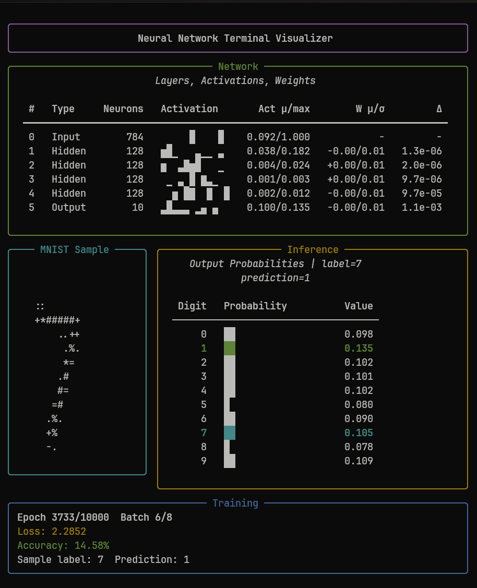
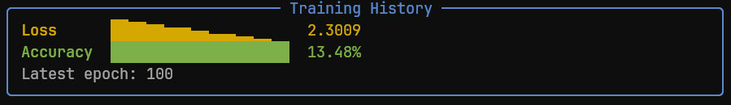

# Neural Network from Scratch



An educational neural-network playground built with NumPy and Rich. The project implements a fully connected MNIST classifier from first principles, then wraps it in a polished terminal interface where you can design the network, train it, inspect activations, watch weights update, run inference, evaluate accuracy, and save/load checkpoints.

The goal is not to hide the math behind a framework. The goal is to make the moving parts visible: layers, neurons, activations, gradients, predictions, and training metrics are all exposed in the terminal.



## What You Can Do

- Build a neural network interactively from the terminal.
- Add, remove, and resize hidden layers before training.
- Train on MNIST while watching a live Rich dashboard.
- See layer activations, weight statistics, and update magnitudes during training.
- Render MNIST samples directly in the terminal.
- Run inference against test samples and inspect output probabilities.
- Evaluate test accuracy.
- Save and load model checkpoints as `.npz` files.
- Read the implementation without needing PyTorch, TensorFlow, or Keras.

## Quick Start

From the repository root:

```bash
python -m pip install -e ".[dev]"
python scripts/verify_mnist.py
nnfs
```

If you do not want to install the package in editable mode:

```bash
python -m pip install -r requirements.txt
PYTHONPATH=src python -m neural_network_from_scratch.cli
```

## Main Commands

```bash
nnfs
```

Launches the interactive terminal lab. This is the best entrypoint for exploring the project.

```bash
nnfs-train
```

Runs the standard training flow without the interactive menu.

```bash
nnfs-visual --interactive
```

Runs the visual training dashboard with prompt-based configuration.

```bash
pytest
```

Runs the test suite.

## Terminal Lab

The `nnfs` menu is designed to feel like a small terminal application rather than a one-off script. The main screen shows:

- the current network architecture;
- parameter counts per layer;
- whether a model is currently built;
- training history;
- last loss and accuracy;
- checkpoint path;
- menu actions grouped by design, model, run, and artifact tasks.

During training, the live dashboard shows:

- layer-by-layer activation samples;
- activation mean and max values;
- weight mean and standard deviation;
- gradient update magnitudes;
- the watched MNIST sample;
- output probabilities for digits `0` through `9`;
- loss and accuracy for the current training run.

The watched MNIST sample is only a visualization target. Training still happens on batches from the training set.

## How It Works

The model is a plain fully connected classifier:

- input dimension: `28 * 28 = 784`;
- output classes: `10`;
- hidden layers: configurable;
- hidden activation: ReLU;
- output activation: Softmax;
- loss: cross-entropy;
- optimizer: mini-batch gradient descent.

Runtime flow:

1. MNIST IDX gzip files are loaded and validated from `data/mnist/`.
2. `NeuralNetwork` builds an input layer, zero or more hidden layers, and an output layer.
3. `predict()` performs the forward pass.
4. `backProp()` calculates gradients for trainable layers.
5. `Layer.updateValues()` applies gradient descent updates.
6. Training metrics and visual state are rendered with Rich.
7. Checkpoints can be saved and loaded through NumPy `.npz` files.

## Data

The repository expects MNIST gzip files under `data/mnist/`:

```text
data/mnist/train-images-idx3-ubyte.gz
data/mnist/train-labels-idx1-ubyte.gz
data/mnist/t10k-images-idx3-ubyte.gz
data/mnist/t10k-labels-idx1-ubyte.gz
```

The loader validates IDX magic numbers, image dimensions, byte counts, and label ranges before training.

Verify the tracked dataset files with:

```bash
python scripts/verify_mnist.py
```

## Project Structure

```text
.
├── data/mnist/                         # MNIST gzip files and checksum manifest
├── docs/assets/                        # README screenshots and project media
├── scripts/
│   └── verify_mnist.py                 # MNIST checksum verification
├── src/neural_network_from_scratch/
│   ├── activations.py                  # ReLU and Softmax
│   ├── checkpoints.py                  # Save/load model checkpoints
│   ├── cli.py                          # Interactive Rich terminal app
│   ├── data.py                         # MNIST IDX gzip loading and validation
│   ├── layers.py                       # Layer state, forward pass, updates
│   ├── network.py                      # Network topology, predict, backpropagation
│   ├── rendering.py                    # Rich renderables for dashboards and tables
│   ├── settings.py                     # Model and training defaults
│   ├── train.py                        # Standard training/evaluation orchestration
│   └── visual_train.py                 # Live visual training entrypoint
├── tests/                              # Unit tests and smoke coverage
├── main.py                             # Backwards-compatible script entrypoint
├── pyproject.toml                      # Package metadata and console scripts
└── requirements.txt                    # Runtime dependencies
```

## Development

Install development dependencies:

```bash
python -m pip install -e ".[dev]"
```

Run tests:

```bash
pytest
```

The test suite covers activation functions, MNIST loading validation, network topology, forward output shape, backpropagation gradient shapes, one training update, batching, rendering smoke checks, checkpoint round-tripping, and evaluation helpers.
